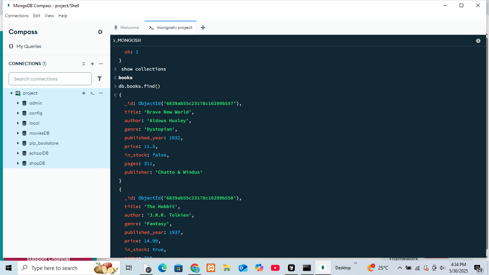

# 📚 MongoDB Fundamentals Assignment

This project demonstrates basic and advanced MongoDB operations including CRUD, aggregations, indexing, and performance analysis using a fictional bookstore dataset.

## 📦 Project Structure

```
.
├── insert_books.js        # Script to insert sample book data
├── queries.js             # All MongoDB queries (CRUD, advanced, aggregation, indexing)
├── README.md              # Instructions and project overview
└── screenshot.png         # Screenshot of MongoDB Compass showing sample data
```

---

## 🛠️ Setup Instructions

### 1. Prerequisites

- [Node.js](https://nodejs.org/) installed
- [MongoDB Community Edition](https://www.mongodb.com/try/download/community) running locally OR use [MongoDB Compass](https://www.mongodb.com/products/compass)
- MongoDB running on default port: `mongodb://localhost:27017`

---

### 2. Install Dependencies

Navigate to the project directory in your terminal and run:

```bash
npm install mongodb
```

This installs the MongoDB Node.js driver.

---

## ▶️ How to Run the Scripts

### ✅ Insert Sample Book Data

To populate the database with 10+ books, run:

```bash
node insert_books.js
```

This will insert documents into the `books` collection under the `plp_bookstore` database.

---

### ✅ Run MongoDB Queries

You can open the `queries.js` file and copy-paste each query into:

- **MongoDB Shell (`mongosh`)**, or
- **MongoDB Compass > Aggregations/Find tabs**

Make sure you’re connected to the `plp_bookstore` database.


## 🖼️ Screenshot

📸 Included is a screenshot (`screenshot.png`) showing the `books` collection with documents inserted and visible in **MongoDB Compass**.

---

## 👨‍💻 Author

- **Duke Mochama** – [GitHub Profile](https://github.com/yourusername)

---

